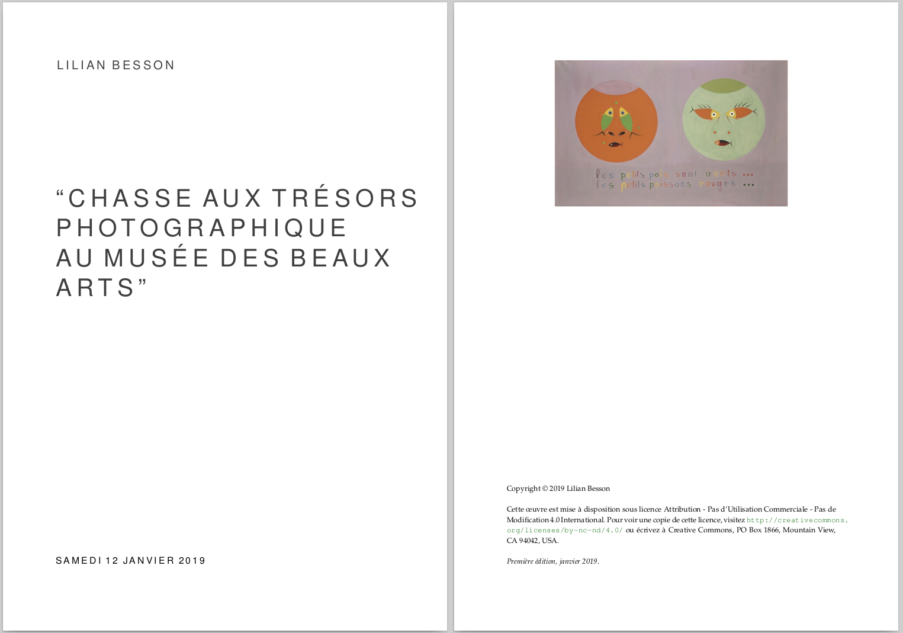
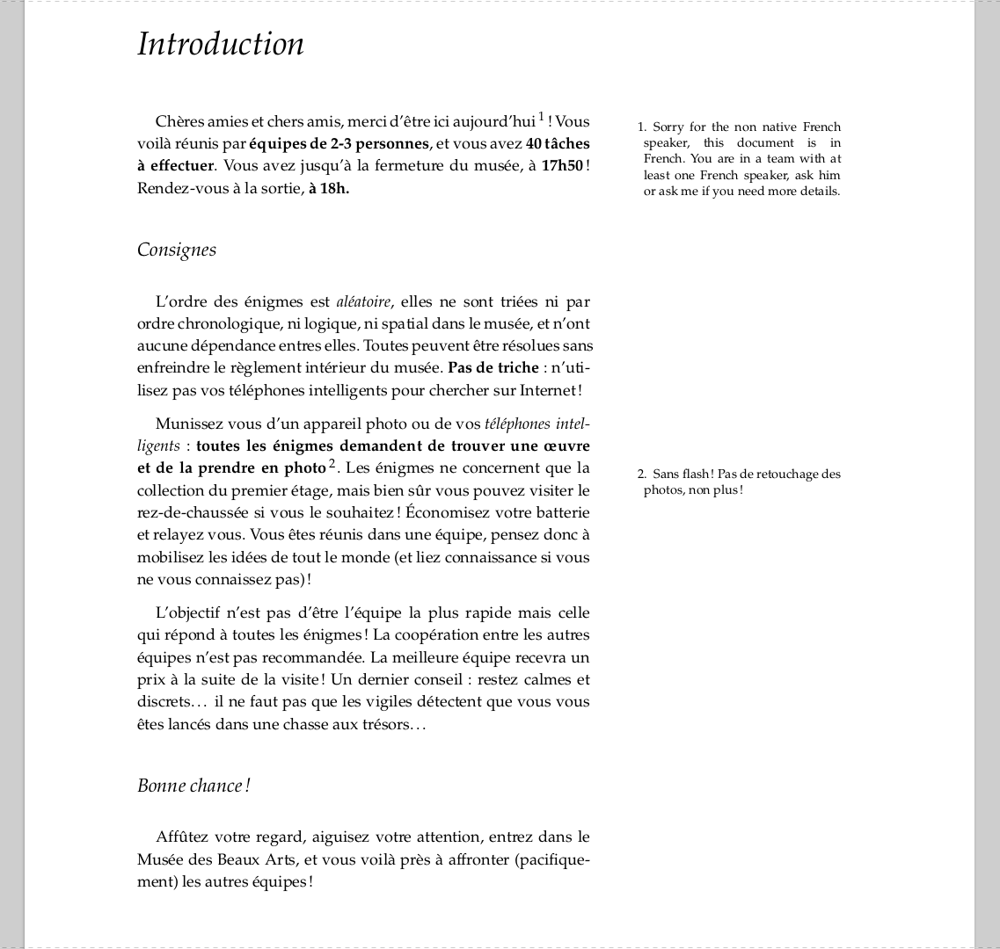
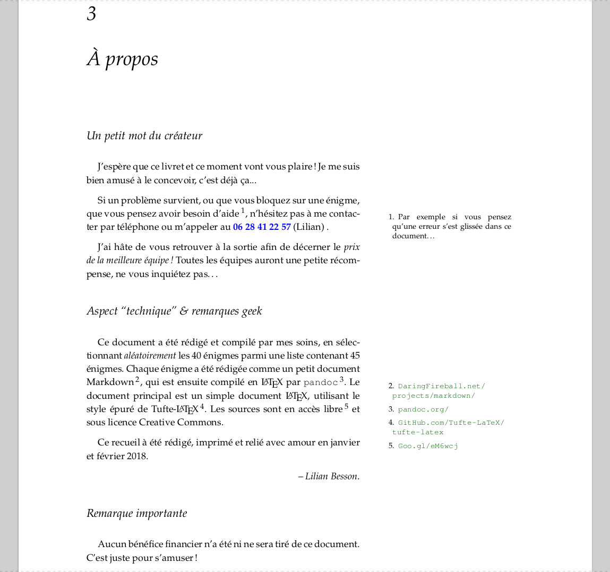
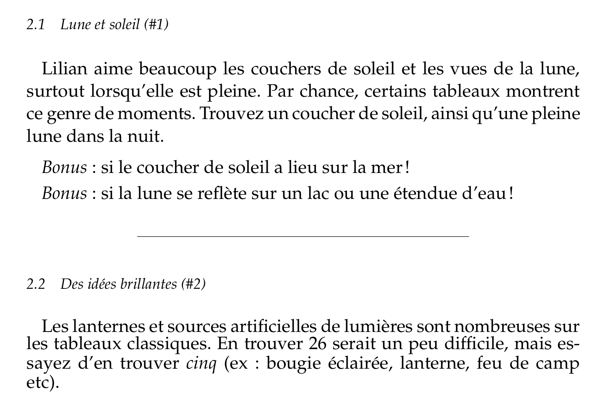

# Chasse aux trésors au Musée des Beaux Arts de Rennes pour mes 26 ans

## Aperçu du document
- Première page :



TODO screeshots!

- Introduction avec les règles du jeu et conclusion :

<a href="https://perso.crans.org/besson/publis/Chasse-aux-tresors-au-Musee-des-Beaux-Arts-pour-mes-26-ans.git/main.pdf"></a><a href="https://perso.crans.org/besson/publis/Chasse-aux-tresors-au-Musee-des-Beaux-Arts-pour-mes-26-ans.git/main.pdf"></a>

- Liste d'énigmes : dans ce dossier [`src/`](src/).

- Exemple de deux énigmes ([1](srd/1.md) et [2](src/2.md), des clins d'œil à Kaamelott) :



## À propos

Pour fêter mes 26 ans, j'ai organisé une"chasse aux trésors", au [musée des Beaux Arts à Rennes](http://mba.rennes.fr/), en janvier 2019.

J'ai écrit 26 énigmes, consistant pour la plupart en une tâche simple du genre ["prendre en photo 5 extraits écrits en langue ancienne"](src/1.md).

J'avais réunis une douzaine d'ami-e-s, regroupé-e-s en équipe de 2-3 personnes.

Ce dépôt Git contient les sources (LaTeX et Markdown), des modèles et des scripts pour créer des livres d'énigmes.

---

## Construire les livrets d'énigmes

- Dépendances : git, make, pdflatex, pandoc, python, [PDFCompress](https://bitbucket.org/lbesson/bin/src/master/PDFCompress) et bash. Testé seulement sous [XUbuntu 17.10](https://xubuntu.org/getxubuntu/),
- Clonez ce dépôt,
```bash
$ cd /tmp/  # ou n'importe où
$ git clone https://github.com/Naereen/Chasse-aux-tresors-au-Musee-des-Beaux-Arts-pour-mes-26-ans.git
$ cd Chasse-aux-tresors-au-Musee-des-Beaux-Arts-pour-mes-26-ans.git
```
- **ATTENTION** : renseignez le nombre d'équipes `NB_EQUIPES`, le nombre de joueurs par équipes `NB_PAR_EQUIPES` et le nombre de questions par fiche d'énigmes `NB_QUESTIONS`, dans le fichier [`config.sh`](config.sh),
- Si besoin, rajoutez des énigmes (en rédigeant des petits fichiers Markdown, suivant [ce modèle](template.md)), comme ceux dans ce dossier [`src`](src/),
- Enfin, construisez tous les livrets en appelant `make all_pdf`. Ça peut prendre quelques minutes !
```bash
$ make all_pdf
```
- Cela va constituer, dans le dossier [`output/`](output/), `NB_EQUIPES` différents livrets, avec simplement un document PDF compilé, chacun contenant `NB_QUESTIONS` questions. La source LaTeX n'est pas sauvegardée, pour assurer une non-reproductibilité de l'échantillon aléatoire ! (inutile, mais drôle !)

----

## Sources et idées
- Une visite au Musée des Beaux Arts de Rennes !
- De l'inspiration et de nombreuses sources...
- Et surtout, [le code développé l'an dernier pour l'anniversaire de mes 25 ans](https://github.com/Naereen/Chasse-aux-tr-sors-au-Louvre-pour-mes-25-ans/)

----

## Aspect technique
- Ce document a été rédigé et compilé par mes soins, en sélectionnant *aléatoirement* des énigmes parmi une [liste d'énigmes](src/). Chaque livret contient **26** énigmes, dans un ordre aléatoire (uniforme).
- Chaque énigme a été rédigée comme un document [Markdown](https://daringfireball.net/projects/markdown/), qui est ensuite compilé en LaTeX par [`pandoc`](http://pandoc.org/).
- Le document principal est un simple document LaTeX, utilisant le style très épuré de [Tufte-LaTeX](https://github.com/Tufte-LaTeX/tufte-latex).
- Ce recueil à été rédigé et imprimé en janvier 2019.

----

## :scroll: Licence ? [](https://github.com/Naereen/Chasse-aux-tresors-au-Musee-des-Beaux-Arts-pour-mes-26-ans/blob/master/LICENSE)
Ce dépôt git et tous les fichiers contenus sont publiés librement sous les termes de la [Licence CC BY-NC-ND 4.0](http://creativecommons.org/licenses/by-nc-nd/4.0/) (voir le fichier [LICENSE](LICENSE)).
© [Lilian Besson](https://GitHub.com/Naereen), 2019.

**Note : aucun bénéfice financier n'a été ni ne sera tiré de ces documents.**

[](http://commonmark.org)
[](https://pandoc.org)
[](https://www.latex-project.org/)
[](https://GitHub.com/Naereen/Chasse-aux-tresors-au-Musee-des-Beaux-Arts-pour-mes-26-ans/graphs/commit-activity)
[](https://GitHub.com/Naereen/ama.fr)
[](https://github.com/Naereen/Chasse-aux-tresors-au-Musee-des-Beaux-Arts-pour-mes-26-ans/blob/master/LICENSE)
[](https://GitHub.com/Naereen/Chasse-aux-tresors-au-Musee-des-Beaux-Arts-pour-mes-26-ans/)

[](https://GitHub.com/Naereen/)
[](http://ForTheBadge.com)
[](https://GitHub.com/)

